# monitoring-stack
This section will take part of monitoring part

1. Install helm charts
```
curl https://raw.githubusercontent.com/helm/helm/main/scripts/get-helm-3 | bash
helm version
```

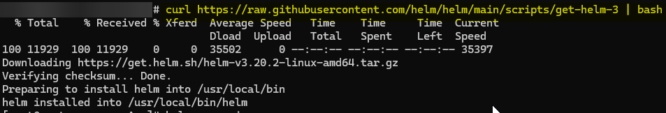
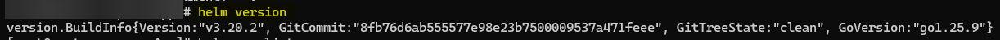


2. Add prometheus helm repository
```
helm repo add prometheus-community https://prometheus-community.github.io/helm-charts
helm repo update
helm repo list
```


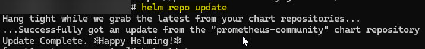

3. Install kube-prometheus-stack
```
helm install monitoring prometheus-community/kube-prometheus-stack --namespace monitoring --create-namespace
kubectl get pods -n monitoring
```

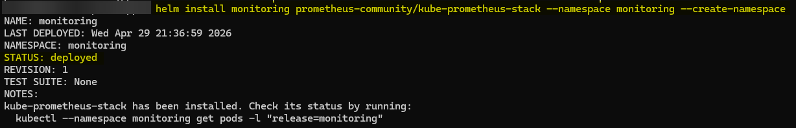
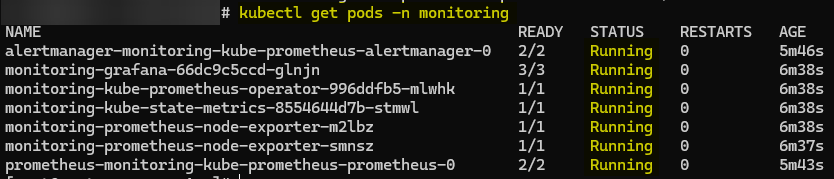

4. Access Prometheus
- As we are running all Kubernetes pods inside VM and wants to access all service outside VM. For this we have to change that service type into "NodePort" which we want to access outside of VM
```
kubectl edit svc monitoring-kube-prometheus-prometheus -n monitoring
```
Replace "type: ClusterIP" with "type: NodePort"
```
kubectl get svc -n monitoring
```

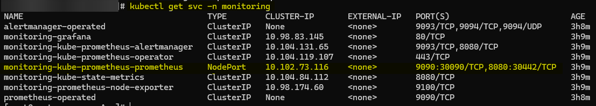

- Access prometheus outside from VM
```
http://192.168.56.107:30090
```

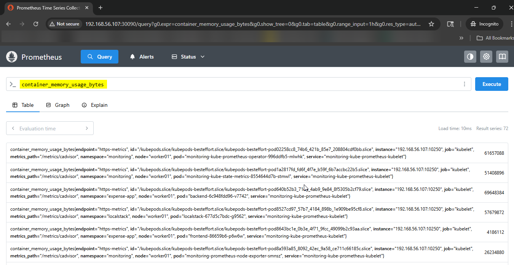
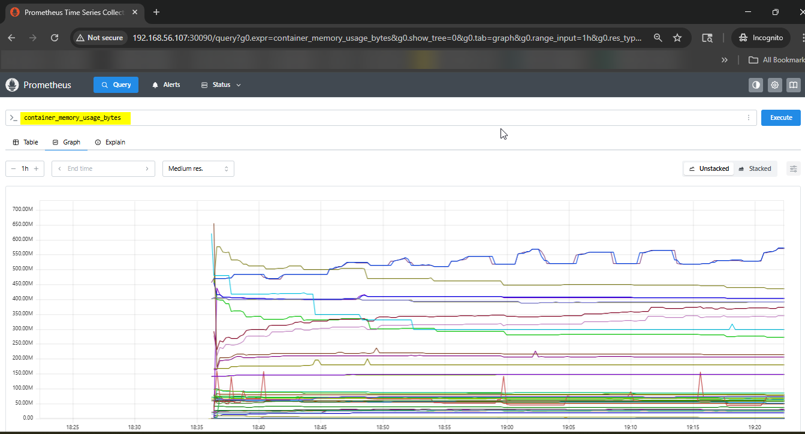

5. Ingress
- We have to enable ingress metrics for this we will edit ingress-nginx deployment's yaml file
```
kubectl edit deployment ingress-nginx-controller -n ingress-nginx
```
and add "--enable-metrics=true"

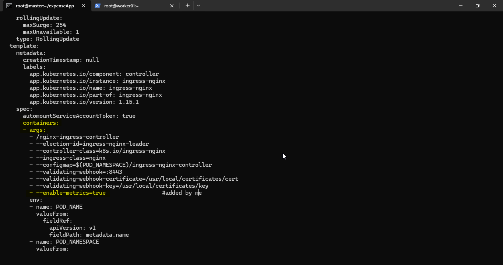
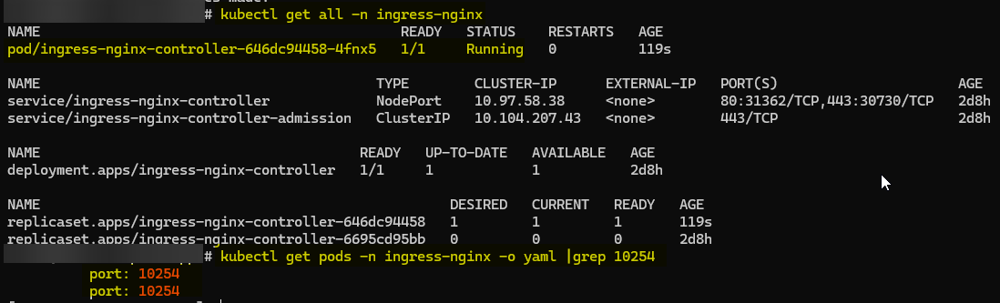

- Create ingress-nginx-controller-metrics service inside "ingress-nginx" namespace
```
kubectl apply -f ingress-controller-metrics.yaml
kubectl get svc -n ingress-nginx
```

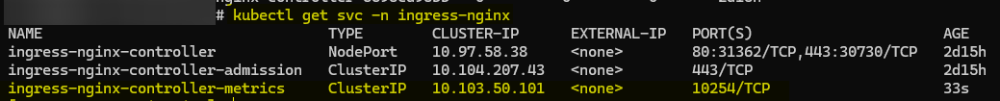

- test ingress-metrics
```
kubectl run curl-test --image=curlimages/curl -it --rm -- sh
curl ingress-nginx-controller-metrics.ingress-nginx:10254/metrics
```
output should be like: # HELP nginx_ingress_controller_requests

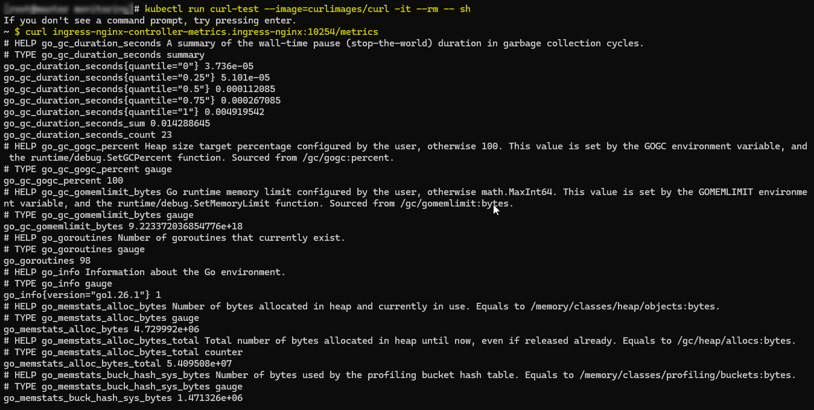


- created service monitor for ingress metrics
```
kubectl apply -f ingress-servicemonitor.yaml
```

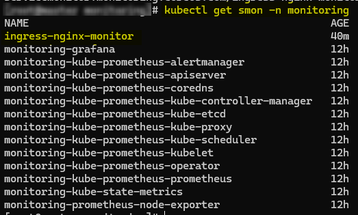

- See metrics in Prometheus and Dashboard in Grafana

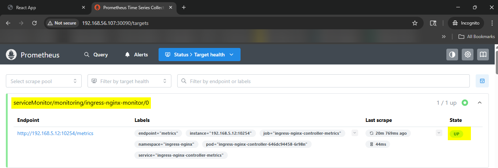
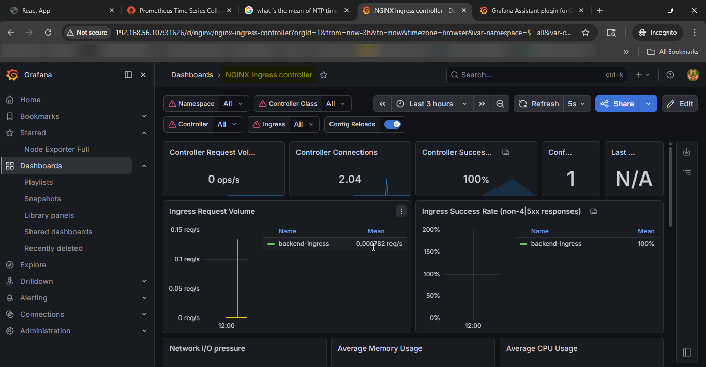

6. Backend
- check metrics of backend inside debug pod
```
# kubectl run -i debug --image=nicolaka/netshoot --rm -n expense-app --restart=Never -- curl http://backend-service:8080/metrics
```
- If you didn't get any metrics list here, then modify backend source code and add there below metrics method
```
const promBundle = require("express-prom-bundle");
const metricsMiddleware = promBundle({
  includeMethod: true,
  includePath: true,
  includeStatusCode: true,
  promClient: {
    collectDefaultMetrics: {}
  }
});
app.use(metricsMiddleware);
```

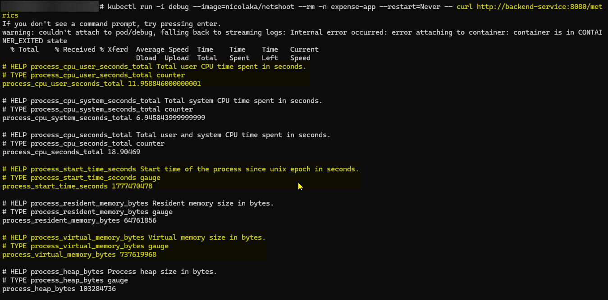

- make backend-service's port name as "http" so that ServiceMonitor can access backend pod through backend-service
```
kubectl edit svc backend-service -n expense-app -o yaml
```
add:
```
ports:
- name: http   # IMPORTANT
port: 8080
targetPort: 8080
```
- create ServiceMonitor for backend to access metrics by Prometheus
```
kubectl apply -f backend-servicemonitor.yaml
kubectl get svc -n monitoring
```

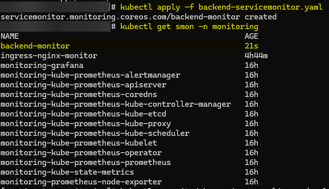
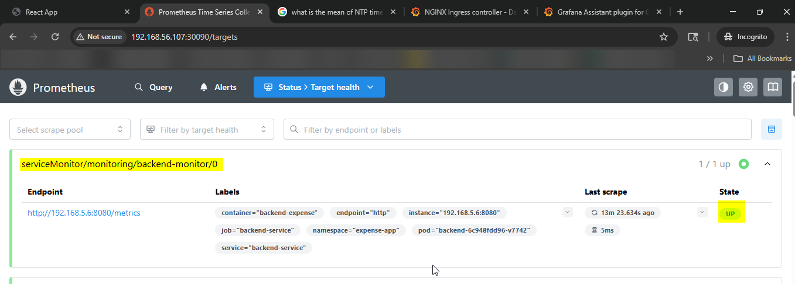


6. DB
- create secretes file for db
```
kubectl create secret generic --from-file=.my.cnf -n expense-app
```
- create mysql-exporter deployment
```
kubectl apply -f mysql-exporter.yaml
```
- create mysql-exporter service
```
kubectl apply -f mysql-exporter-service.yaml
```

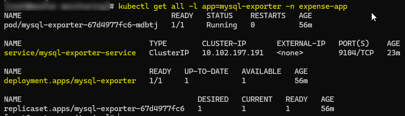

- test mysql exporter metrics
```
kubectl run -it debug --rm --image=curlimages/curl -n expense-app -- sh
curl mysql-exporter-service:9104/metrics
```

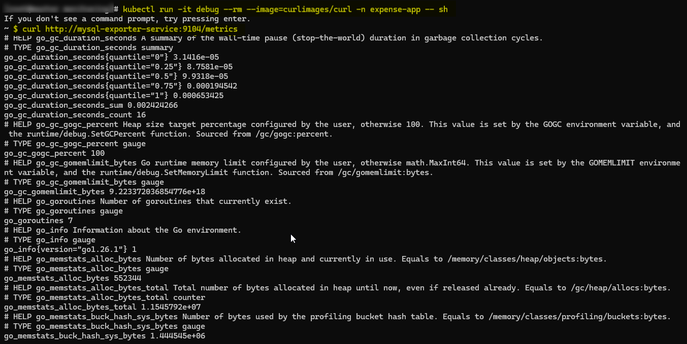

- create mysql service monitor so that prometheus can get mysql-exporter metrics from this
```
kubectl apply -f mysql-servicemonitor.yaml
```

![mysql-service-monitor]
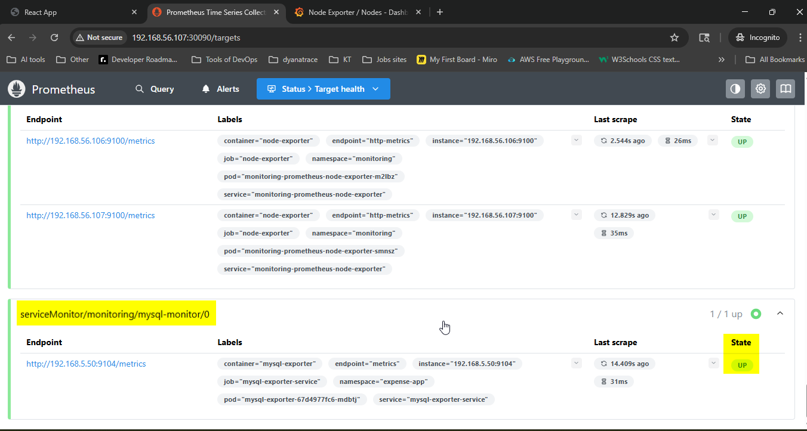
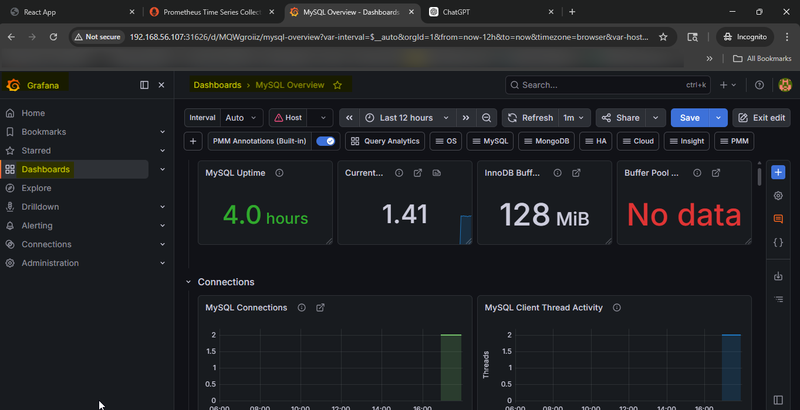